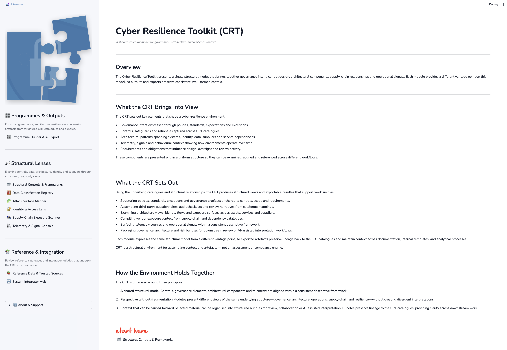
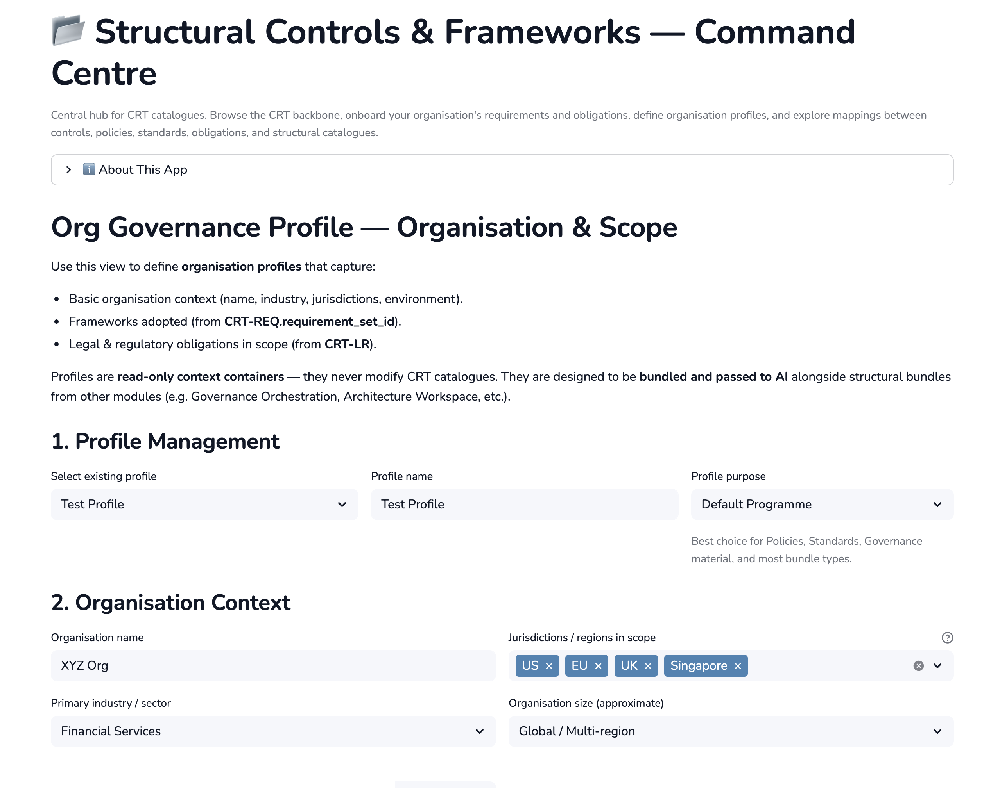
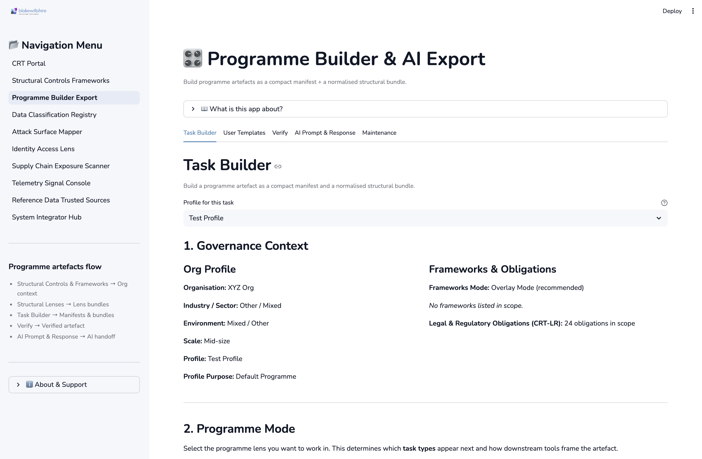

# Cyber Resilience Toolkit (CRT) — Structural Governance Environment

The Cyber Resilience Toolkit (CRT) is a catalogue-driven environment for examining cyber resilience through a shared structural model spanning governance intent, controls, architecture, identity, supply-chain relationships, telemetry, and regulatory obligations.

CRT provides consistent structure and traceability across these domains so that material can be examined, aligned, and carried forward into documentation, programmes, or downstream reasoning workflows.

---

## Python Version

Python 3.11–3.12 (tested on 3.12.x)

---

## Quick Start

### 1. Clone

```bash
git clone https://github.com/blakewiltshire/cyber-resilience-toolkit.git
cd cyber-resilience-toolkit
```

### 2. Create a Virtual Environment

```bash
python3 -m venv .venv
```

If `python3` is not available on your system, try:

```bash
python -m venv .venv
```

### 3. Activate the Environment

**macOS / Linux**

```bash
source .venv/bin/activate
```

**Windows (PowerShell)**

```powershell
.\.venv\Scripts\Activate.ps1
```

**Windows (cmd)**

```bat
.\.venv\Scripts\activate.bat
```

### 4. Install Requirements

```bash
python -m pip install --upgrade pip
pip install -r requirements.txt
```

### 5. Run the Application

```bash
streamlit run app.py
```

The application will launch at:

http://localhost:8501

---

## What This Is (and Isn’t)

**Is:**  
A structural, catalogue-first environment for exploring how governance, controls, architecture, data, identity, suppliers, and operational signals relate within a cyber-resilience context.

**Isn’t:**  
An assessment engine, automated assurance tool, configuration system, or advisory product. CRT does not provide recommendations, scores, compliance outcomes, or operational instructions.

---

## Screenshots

### 🧭 Portal Home — Structural Orientation



The home portal introduces the shared structural model and clarifies:

- What the CRT brings into view  
- What the environment produces  
- How modules interrelate  
- Where to begin  

This is the conceptual anchor before moving into structured views.

---

### 📂 Structural Controls & Frameworks — Model Backbone



The backbone view of CRT’s shared model:

- Control architecture (CRT-C / CRT-F / CRT-N)
- Governance intent and policy alignment
- Requirements and structural mapping
- Consistent catalogue relationships

This module provides the structural grounding for downstream exports and artefacts.

---

### 🎛 Programme Builder & AI Export — Structured Artefact Assembly



The Programme Builder organises catalogue elements into structured bundles suitable for:

- Governance artefacts  
- Policy and standard drafting  
- Third-party questionnaires  
- Control narratives  
- Architecture notes  
- AI-assisted interpretation workflows  

Exports preserve lineage to the underlying CRT catalogues.

---

## Where to Start

- **Structural Controls & Frameworks** — the backbone view of CRT’s shared model  
- **Programme Builder & Export** — assemble structured governance or architecture artefacts  
- **Structural Lenses** — examine assets, data, identity, suppliers, and signals  
- **Reference & Integration** — explore catalogues and trusted reference material  

Each module presents a different perspective on the same underlying structure, without fragmenting or redefining it.

---

## Structure (High-Level)

```
cyber-resilience-toolkit/
  apps/          # Canonical catalogues, defaults, and samples
  core/          # Shared structural logic and helpers
  pages/         # Streamlit modules (views and builders)
  docs/          # Reference notes and bundled documentation
  brand/         # Visual assets
  data/          # Optional local context
  images/        # App images
  app.py         # Streamlit launcher
  LICENSE
  requirements.txt
  README.md
```

Canonical catalogues live alongside the modules that use them.  
Generated artefacts are produced locally during use.

---

## License & Use

Free to read and use as provided.

All content and outputs are structural and conceptual in nature.  
No configuration, assurance, or advisory services are provided.

Refer to LICENSE for details.

---

Cyber Resilience Toolkit by Blake Wiltshire  
© Blake Media Ltd.
